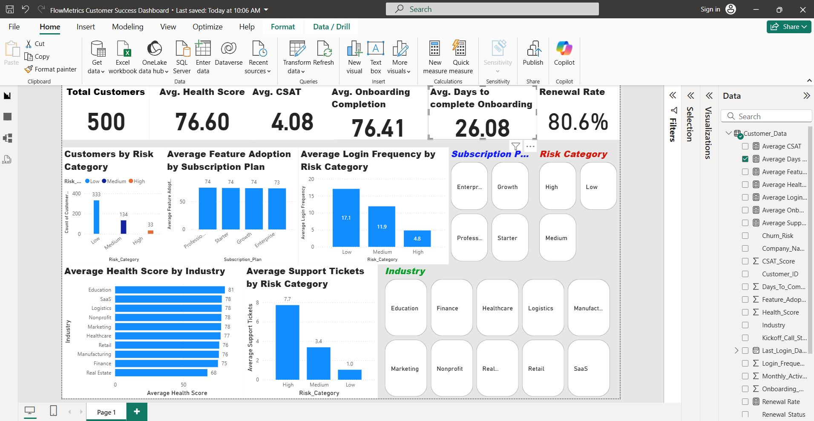

# FlowMetrics Customer Success Dashboard

## Project Overview

FlowMetrics is a fictional SaaS customer success analytics project designed to demonstrate how customer data can be transformed into actionable insights to improve customer retention, engagement, and business growth.

This project analyzes a dataset of **500 fictional SaaS customers** to identify customer health trends, churn risks, subscription performance, onboarding effectiveness, and opportunities for proactive customer success actions.

## Project Type

**Customer Success Analytics | SaaS Business Intelligence Dashboard**

## Industry

**Software as a Service (SaaS)**

## Dataset

**500 fictional SaaS customer records**

The dataset contains customer lifecycle information including:

- Customer profile details
- Industry and company size
- Subscription plans
- Customer tenure
- Product usage
- Login frequency
- Feature adoption
- Support interactions
- Customer health scores
- CSAT scores
- Renewal status
- Churn risk indicators

## Tools Used

- **Microsoft Excel** – Dataset creation, cleaning, and preparation
- **Power BI Desktop** – Data modeling, dashboard development, and visualization
- **DAX Measures** – Customer health metrics, retention KPIs, and customer success calculations

## Business Questions Answered

The dashboard was designed to answer key customer success questions:

- How many customers are active, at risk, or likely to churn?
- Which subscription plans have the strongest customer engagement?
- Which industries have higher customer health scores?
- What factors influence churn risk?
- How effective is customer onboarding?
- Which customers require proactive intervention?

## Dashboard Preview

A preview image of the Power BI dashboard is included above.

Interactive Power BI dashboard file:

**FlowMetrics_Customer_Success_Dashboard.pbix**

## Dashboard Features

### Customer Health Overview

Includes key customer success metrics:

- Total Customers
- Average Health Score
- Average CSAT Score
- Average Onboarding Completion
- Average Days to Complete Onboarding
- Renewal Rate

### Customer Risk Analysis

Analyzes customers by:

- Low, Medium, and High-risk categories
- Support ticket patterns
- Login frequency
- Customer health indicators

### Subscription Performance

Provides insights into:

- Customer distribution by subscription plan
- Feature adoption across plans
- Engagement trends

### Customer Segmentation

Analyzes customers by:

- Industry
- Subscription plan
- Risk category

## Customer Success Metrics Tracked

The dashboard tracks important SaaS customer success indicators including:

- Customer Health Score
- Churn Risk Level
- Renewal Rate
- CSAT Score
- Product Adoption
- Login Engagement
- Support Ticket Activity
- Onboarding Completion
- Customer Segmentation

## Key Insights

The dashboard helps customer success teams:

- Identify customers requiring immediate attention
- Prioritize retention strategies
- Improve onboarding experiences
- Monitor customer engagement patterns
- Make data-driven customer success decisions

## Customer Success Recommendations

Based on the analysis:

1. Create proactive outreach programs for high-risk customers.
2. Provide additional onboarding support for customers with low completion rates.
3. Monitor product adoption to identify engagement gaps.
4. Develop customer health scoring processes.
5. Use customer insights to improve retention and expansion opportunities.

## Project Files

📊 **FlowMetrics_500_Customers.xlsx**  
Fictional SaaS customer dataset used for analysis.

📈 **FlowMetrics_Customer_Success_Dashboard.pbix**  
Interactive Power BI dashboard containing customer success analytics.

🖼️ **FlowMetrics_Customer_Success_Dashboard.png**  
Dashboard preview image.

## Skills Demonstrated

- Customer Success Analytics
- SaaS Metrics Analysis
- Data Cleaning
- Business Intelligence Reporting
- Dashboard Development
- Customer Retention Analysis
- Data Visualization
- Excel Analytics
- Power BI
- DAX Calculations

## Project Outcome

This project demonstrates how Customer Success Managers and Operations teams can use data-driven insights to monitor customer health, identify churn risks, improve onboarding outcomes, and create proactive retention strategies.

---

**Created by:** Chioma Iwuchukwu  
**Focus Areas:** Customer Success | Data Analytics | Business Intelligence
